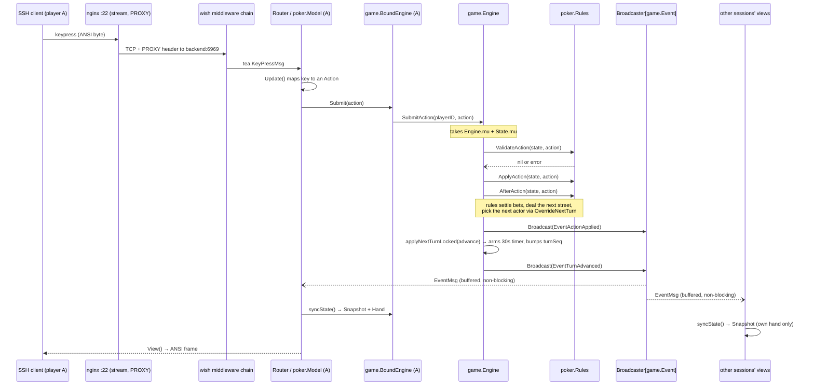
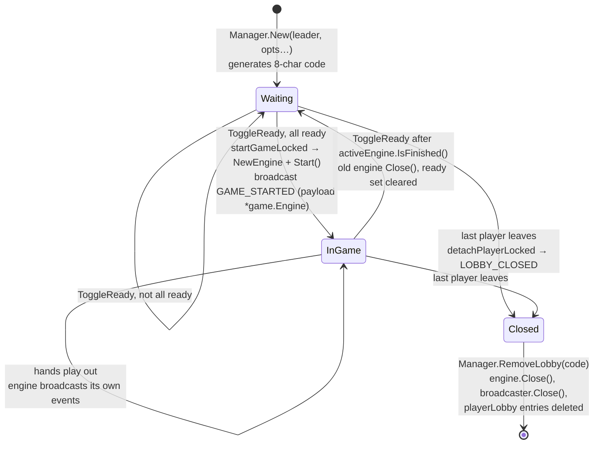
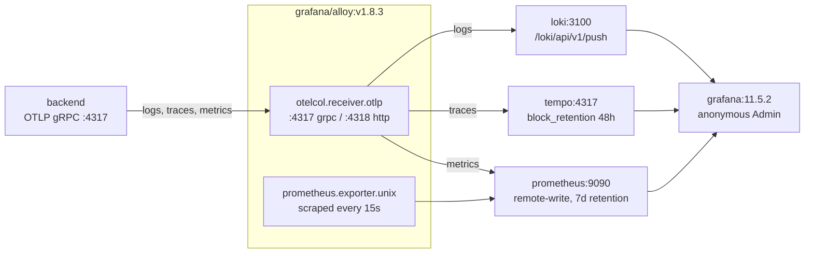

# terminal-card — onboarding technical document

Single-source-of-truth onboarding for the Go SSH game server. Every name, path and
number below is taken from the code as it stands; nothing is generic.

**Companion documents.** `ARCHITECTURE.md` (751 lines) is the narrative architecture
guide and goes deeper on the five internal contracts and the reasoning behind them.
`CLAUDE.md` is the short operational brief. This document is the onboarding entry
point: read it first, then `ARCHITECTURE.md` §4 when you need the contracts in detail.

**A note on scope.** Several topics in the original brief for this document assume a
real-time simulation server. This is a **turn-based card game**, so those sections say
plainly what exists instead rather than inventing an equivalent. The affected topics
are collected in [§9 Premises that do not hold](#9-premises-that-do-not-hold) so you
do not go looking for code that was never written.

---

## Table of contents

1. [Executive summary & core architectural patterns](#1-executive-summary--core-architectural-patterns)
2. [Directory tree & package map](#2-directory-tree--package-map)
3. [SSH transport, TUI rendering (Bubble Tea & Lip Gloss)](#3-ssh-transport-tui-rendering-bubble-tea--lip-gloss)
4. [Event engine, custom broadcaster & state sync](#4-event-engine-custom-broadcaster--state-sync)
5. [End-to-end data flow & diagrams](#5-end-to-end-data-flow--diagrams)
6. [Domain logic & game systems](#6-domain-logic--game-systems)
7. [Observability & diagnostics (Alloy + Loki + Tempo + Prometheus + Grafana)](#7-observability--diagnostics)
8. [Build, deploy, test](#8-build-deploy-test)
9. [Premises that do not hold](#9-premises-that-do-not-hold)

---

## 1. Executive summary & core architectural patterns

### What it is

A multiplayer card-game server whose **only** client is an SSH terminal. There is no
web client, no game HTTP API, and no WebSocket layer. A player runs `ssh tty.cards`,
the server allocates a PTY, and a Bubble Tea program renders the whole UI as ANSI text
over the SSH channel. Five games ship: **Crazy Eights**, **No-Limit Texas Hold'em**
(a 10-hand match), **Uno**, **Hearts** and **Gin Rummy**.

An Astro static marketing site lives in `web/` and is served by the same nginx, but it
is not part of the Go module — it consumes the read-only JSON in `internal/httpapi`.

### Design philosophy

Three commitments explain most of the code:

1. **One process holds the table.** All live state is in memory in a single process.
   No Redis, no message broker, no shared cache. Postgres stores only what must
   outlive the process: users, keys, games, Elo, match history. See
   [§4.2](#42-in-memory-store-and-the-scaling-boundary).
2. **The engine knows nothing about the terminal.** `internal/game` has no import of
   `internal/tui`, no route strings, no database. It is enforced by the package graph,
   not by convention.
3. **Nothing may hold the table hostage.** Every seat has a 30-second clock, three
   consecutive misses loses it, and every lock has a documented order.

### Not tick-driven

There is **no game loop and no fixed tick rate.** The engine advances only when a
player submits an action or a turn timer fires. What periodic work exists is
per-session UI scheduling:

| Timer | Interval | Where |
|---|---|---|
| Turn countdown (adaptive) | 1 s, or **100 ms** under 6 s remaining | `internal/tui/views/game/layout.go` `ClockTickFor` |
| Lobby-browser refresh | 2 s (`browseRefresh`) | `internal/tui/views/lobby/join.go` |
| Router idle watchdog | 10 s poll, quits after 5 min idle | `internal/tui/router/router.go` |
| Engine turn clock | 30 s one-shot (`DefaultTurnTimeout`), re-armed | `internal/game/engine.go` |

Nothing animates: the card fan draws the selected card on top rather than moving it,
so there is no frame loop anywhere in the UI.

### Design patterns in use

| Pattern | Where | Note |
|---|---|---|
| **Elm Architecture (MUV)** | every `internal/tui/views/**` model | `Init`/`Update`/`View`, immutable-ish message flow |
| **Fan-out broadcaster (Observer)** | `internal/broadcaster.Broadcaster[T]` | generic, latest-wins, per-subscriber buffered channel |
| **Strategy** | `game.Rules` interface, implemented by `crazyeight.Rules` and `poker.Rules` | engine calls rules, never the reverse |
| **Factory + single registration point** | `internal/catalog.All`, `game.Registry` | one `Entry` carries both the rules factory and the view constructor, so they cannot drift |
| **Functional options** | `lobby.Option` (`WithCardGame`, `WithMaxPlayers`, `WithPrivate`, `WithRanked`), `game.EngineOption` (`WithTurnTimeout`) | |
| **Facade** | `game.BoundEngine` via `game.Bind(engine, playerID)` | the default path is safe - `Submit` cannot act as another player, `Hand()` clones only yours, every method is nil-safe. Not a boundary: `Engine()` exposes the whole table for views that must render it |
| **Embedded base type** | `gameview.Session` embedded in every game view's `Model` | subscribe, listen, cursor, leave and close exist once, so a new game writes only its rules rendering |
| **Repository** | `db.UserRepository`, `db.MatchRepository` declared in `internal/db`, implemented in `internal/repository` | interfaces live with the consumer |
| **Middleware chain** | `wish.WithMiddleware(...)` in `internal/ssh/server.go`; `withCORS`/`withRateLimit` in `internal/httpapi` | |
| **Generation counter / fencing token** | `Engine.turnSeq uint64` | invalidates in-flight timers so a player who acted is never charged a miss |
| **Snapshot / DTO** | `game.StateSnapshot`, `game.PlayerSnapshot`, `lobby.BrowseEntry` | built under one lock, then rendered lock-free |
| **Double-checked locking with TTL** | `repository.gormUserRepository.BestPlayers` (5 min) | |
| **Dirty-flag cache invalidation** | `Manager.cacheDirty atomic.Bool` + `publicLobbyCacheTTL` (2 s) | atomic specifically to avoid inverting lock order |
| **Optional interface (capability probe)** | `game.PlayerLeaveHandler`, `game.TurnTimeoutHandler`, `router.Closer` | rules and views opt in by implementing |
| **Sentinel errors** | `broadcaster.ErrClosed`/`ErrAtCapacity`, `repository.ErrUsernameTaken`…, `ssh.ErrNoPublicKey`… | |
| **Fan-out log handler** | `observability.NewFanoutHandler` | stderr JSON + OTLP in one `slog.Handler` |

### Idiomatic Go practices

- **Context propagation** — `context.Context` first parameter through every repository
  method; `router.GlobalContext.SessionCtx` is cancelled when the SSH session ends;
  `Manager.appCtx` is the parent of every ranked-finalize write.
- **Error wrapping** — `%w` throughout, lowercase messages, checked by the `wrapcheck`
  linter. Sentinels preserved through `mapRegisterError` so `errors.Is` still matches.
- **Non-blocking channel sends** — `Broadcast` uses `select`/`default` and never blocks
  on a slow SSH client.
- **Interfaces defined by the consumer** — `httpapi.SessionCounter` and
  `httpapi.LobbyCounter` exist so `httpapi` need not import `ssh` or `lobby`.
- **Atomics where a lock would invert an order** — `Manager.cacheDirty`,
  `observability.SSHSessionsActive`.
- **Generics** — `Broadcaster[T]` is the only generic type; used at `Event` and
  `lobby.Event`.
- **`defer` ordering as a correctness tool** — `cmd/server/main.go` registers defers in
  an order chosen so LIFO unwinding drains match writes *before* closing the DB handle
  and reports errors *before* the OTel logger provider shuts down. Both have comments
  saying so.
- **Build tags** — `//go:build integration` on the six tests that need Docker.
- **`goleak`** — `TestMain` guards in six packages.

---

## 2. Directory tree & package map

```
terminal-card/
├── cmd/server/
│   ├── main.go                 process entry: config → OTel → DB → repos → lobby →
│   │                           registry → SSH server → stats API → serve loop
│   └── Dockerfile              3-stage build, final image FROM scratch, USER nonroot
├── internal/
│   ├── broadcaster/            generic fan-out. THE real-time primitive
│   │   └── broadcaster.go      Broadcaster[T], latest-wins, ErrClosed/ErrAtCapacity
│   ├── catalog/
│   │   └── catalog.go          `All` — the ONLY place a game is declared
│   ├── config/
│   │   ├── config.go           env loading, Validate(), DSN(), String() (redacts pw)
│   │   ├── alloy/config.alloy         Grafana Alloy pipeline (OTLP in, LGTM out)
│   │   ├── prometheus/prometheus.yml
│   │   ├── tempo/tempo.yaml
│   │   ├── grafana/provisioning/…     datasources + dashboard provider
│   │   ├── grafana/dashboards/*.json  app-usage, host, logs, traces
│   │   └── nginx.conf          stream{} SSH proxy w/ PROXY protocol + http{} site+API
│   ├── db/                     GORM models AND the repository interfaces
│   │   ├── repository.go       UserRepository, MatchRepository  ← the contract
│   │   ├── users.go            User, PublicKey, Ranking, ValidateUsername
│   │   ├── matches.go          Match, MatchParticipant
│   │   ├── games.go            Game
│   │   ├── gorm.go             Connect(): pool 10 idle / cfg max / 1h lifetime
│   │   └── migrations/         000001_init (single schema; squash while pre-prod)
│   ├── deck/                   cards, piles, shuffling (builder.go, card.go, deck.go)
│   ├── elo/elo.go              Multiplayer Elo, ties 0.5/0.5, headroom-capped deltas
│   ├── game/                   PURE rules/engine. no db, no tui, no routes
│   │   ├── engine.go           Engine: locks, broadcast, RemovePlayer
│   │   ├── turnclock.go        Per-turn timer, idle kick, TurnTimeout/Duration
│   │   ├── player.go           Seat scalars (UserID, Name, Ratings, Cards)
│   │   ├── state.go            State + its own mutex
│   │   ├── rules.go            Rules + the optional handler interfaces
│   │   ├── action.go           Action, Event, EventType, StateSnapshot
│   │   ├── bound.go            BoundEngine — Subscribe/Unsubscribe + Hand/Submit
│   │   ├── registry.go         name → Module lookup
│   │   ├── crazyeight/         rules.go, state.go
│   │   ├── uno/                rules.go, state.go, deck.go
│   │   ├── hearts/             rules.go, state.go, trick.go
│   │   ├── ginrummy/           rules.go, state.go, melds.go, layoffs.go
│   │   └── poker/              rules.go, streets.go, evaluator.go, state.go
│   ├── httpapi/httpapi.go      read-only JSON: /v1/stats, /v1/leaderboard
│   ├── lobby/
│   │   ├── manager.go          lobby registry, codes, join limiter, finalizer drain
│   │   ├── lobby.go            one table: roster, ready, start, persist result
│   │   ├── player.go           FromUser → game.Player
│   │   └── browse.go           BrowseEntry/BrowseFilter/BrowseLobbies — the browser
│   ├── observability/
│   │   ├── otel.go             SetupOTel: logs+traces+metrics over OTLP gRPC
│   │   └── metrics.go          3 atomic counters read by observable instruments
│   ├── ratelimit/
│   │   ├── limiter.go          sliding window; full table evicts, not refuse
│   │   └── netkey.go           NetKey: IPv6 → /64, unmaps v4-in-v6
│   ├── repository/             the GORM implementations (cmd/server + ssh sentinels)
│   │   ├── user.go             Omit("User") on activity; leaderboard cache TTL
│   │   └── match.go            FinalizeRankedMatch: one tx, SELECT … FOR UPDATE
│   ├── ssh/
│   │   ├── server.go           SetupServer, PTY clamp, recoverSession split,
│   │   │                       SessionTracker, sessionLifecycle
│   │   └── auth.go             fingerprint auth, LoadOrRegisterUser
│   ├── systemtest/             cross-package tests only (no production code)
│   ├── testutil/db.go          testcontainers Postgres + production .up.sql migrations
│   └── tui/
│       ├── app.go              Model(): builds GlobalContext, registers every route
│       ├── router/router.go    Router, GlobalContext, ChangeViewMsg, Closer, idle tick
│       ├── styles/
│       │   ├── theme.go        THE only file allowed to name a colour
│       │   └── common.go       sizing (BoxWidth/InnerWidth/…), PadTruncate, layout
│       ├── components/card.go  card glyph rendering
│       └── views/
│           ├── common.go       HandleCommonMsg, NavigateOn, RenderCenteredLayout
│           ├── game/           layout.go (shared table furniture + turn clock),
│           │   │               state.go (BaseState, SyncBaseState)
│           │   │               session.go (Session — the shared view baseline)
│           │   ├── poker/      model.go, update.go, view.go, chips.go
│           │   └── crazyeight/ model.go, update.go, view.go
│           ├── home/  lobby/  leaderboard/  profile/
├── web/                        Astro 7 static site (separate toolchain, pnpm)
├── scripts/                    backup.sh (pg_dump+zstd), dev-session.sh (tmux×3)
├── .github/workflows/test.yml  test · integration · lint · vulncheck
├── compose.yaml                backend, db, migrate, proxy, alloy, loki, tempo,
│                               prometheus, grafana
├── Makefile                    ci = fmt fix lint test build
├── .golangci.yml               33 linters
├── ARCHITECTURE.md             the deep architecture guide
└── CLAUDE.md                   short operational brief
```

### Package responsibilities

| Package | Responsibility | May import |
|---|---|---|
| `cmd/server` | wiring and lifecycle only | everything |
| `internal/broadcaster` | generic fan-out with backpressure policy | stdlib |
| `internal/catalog` | declare the game list once | game, tui views |
| `internal/config` | env → validated `Config` | stdlib, godotenv |
| `internal/db` | models **and** repository interfaces | gorm |
| `internal/repository` | GORM implementations | db, elo, otel |
| `internal/game` | rules engine, pure | deck, player, broadcaster |
| `internal/lobby` | tables, matchmaking-by-browse, result persistence | game, db, elo, broadcaster, ratelimit |
| `internal/ssh` | transport, auth, session lifecycle | config, db, lobby, tui, ratelimit |
| `internal/tui` | presentation only | game (via BoundEngine), lobby, router |
| `internal/httpapi` | read-only public JSON | db, ratelimit |
| `internal/observability` | OTel setup + counters | config |

**The one deliberate exception:** `internal/ssh` imports `internal/repository` for its
error sentinels. Everything else depends on the `db` interfaces.

### Code reading roadmap

Read in this order. Each step is what the previous one hands off to.

1. **`cmd/server/main.go`** — `run()`. The whole startup order and every `defer`.
2. **`internal/config/config.go`** — every knob the process has.
3. **`internal/ssh/server.go`** — `SetupServer`, then the middleware slice (remember it
   executes **last-first**), then `sessionModel` and `releaseSession`.
4. **`internal/ssh/auth.go`** — how a public key becomes a `db.User`.
5. **`internal/tui/app.go`** — the route table; this is the map of the UI.
6. **`internal/tui/router/router.go`** — `GlobalContext`, `Update`, `Goto`, `Closer`.
7. **`internal/tui/views/lobby/create.go`** and **`join.go`** — how a table is opened
   and found.
8. **`internal/lobby/manager.go`**, then **`lobby.go`** — `New` → `JoinLobbyByCode` →
   `ToggleReady` → `startGameLocked`.
9. **`internal/game/engine.go`** — `Start`, `SubmitAction`, `applyNextTurnLocked`,
   `RemovePlayer`, `Close`. The heart of the system.
10. **`internal/game/rules.go`** + **`internal/game/poker/rules.go`** — the contract and
    its most demanding implementation.
11. **`internal/game/bound.go`** — the capability boundary views actually use.
12. **`internal/tui/views/game/poker/{model,update,view}.go`** — a complete MUV triple.
13. **`internal/broadcaster/broadcaster.go`** — small, and the reason disconnects are
    safe.
14. **`internal/lobby/lobby.go` `finalizeFinishedGame`** → **`internal/repository/match.go`**
    — how a finished hand becomes rows.

---

## 3. SSH transport, TUI rendering (Bubble Tea & Lip Gloss)

### 3.1 SSH transport layer

`charm.land/wish/v2` on top of `charm.land/ssh`. There is no HTTP handler and no
WebSocket upgrade anywhere in the game path; the SSH channel **is** the transport.

**Listener stack**, built in `cmd/server/main.go` `serve()`:

```
net.ListenConfig{}.Listen(ctx, "tcp", host:6969)
  └── netutil.LimitListener(listener, cfg.MaxConnections)   // default 1000
        └── &proxyproto.Listener{ReadHeaderTimeout: 10s}    // trusts PROXY header
```

nginx terminates :22 in a `stream {}` block, applies `limit_conn ssh_addr 8` per source
address, and forwards to `backend:6969` with `proxy_protocol on`. **Port 6969 is never
published** — `compose.yaml` carries an explicit warning, because a directly reachable
PROXY-protocol listener lets any peer forge its source address and walk past the
per-IP limiter.

**Handshake and connection timeouts**

| Setting | Value | Why |
|---|---|---|
| `server.HandshakeTimeout` | 20 s | set manually after `wish.NewServer` because wish exposes no option; an unauthenticated socket already holds a `MAX_CONNECTIONS` slot but is invisible to the auth-time limiter |
| `wish.WithIdleTimeout` | 30 min | deliberately looser than the router's 5-minute TUI idle quit |
| PROXY header read | 10 s | |

**Authentication.** `wish.WithPublicKeyAuth(rateLimitAuth(..., func(...) bool { return true }))`
— **any** public key is accepted. Identity is the SHA256 fingerprint
(`cryptossh.FingerprintSHA256`), resolved in `auth.go`:

- `AuthenticateSession(s)` → fingerprint, or `ErrNoPublicKey`.
- `LoadOrRegisterUser(ctx, repo, sshUsername, fingerprint)` → load by fingerprint; if
  absent, `RegisterUserWithKey` — **the SSH login name becomes the username on first
  connect**. Existing users get `UpdateUserActivity`.

Rate limiting happens in the **public-key auth callback**, before a session exists:
`NetKey(host)` → `SlidingWindowLimiter.Allow`. Rejection increments
`RateLimitRejectsTotal` and logs with `remote_addr` + `session_id`.

**Middleware order.** wish runs the slice **last-first**, so the listed order is the
reverse of execution:

```go
wish.WithMiddleware(
    bm.Middleware(sessionModel(deps, tracker)), // executes 4th (innermost)
    activeterm.Middleware(),                    // executes 3rd
    logging.StructuredMiddleware(),             // executes 2nd
    sessionLifecycle(deps, tracker),            // executes 1st (outermost)
)
```

`sessionLifecycle` is outermost **on purpose**: `charm.land/ssh` runs each handler in a
goroutine with no recover, so an escaped panic would kill the process. It starts the
`ssh.session` span and `defer`s `releaseSession`, which must stay a direct `defer`
target because `recover()` only works when called by the deferred function itself.

**PTY allocation** is handled by `activeterm.Middleware()`, which refuses sessions
without an active terminal. There is no manual `s.Pty()` inspection.

**Window resize.** `tea.WindowSizeMsg` is produced by the wish/bubbletea bridge from
SSH `window-change` requests. It is consumed in two places, and both matter:
`Router.Update` stores it on `r.Global` for views built later, and
`views.HandleCommonMsg` updates the *currently mounted* view's own copy. Every view
holds its own `GlobalContext` by value, which is why both exist.

### 3.2 Bubble Tea engine (Elm Architecture)

**Model hierarchy.** `Router` is the root `tea.Model`; exactly one child view is
mounted at a time.

| State | Route const | Model |
|---|---|---|
| Home | `RouteHome` | `home.model` |
| Profile | `RouteProfile` | `profile.model` |
| Leaderboard | `RouteLeaderboard` | `leaderboard.model` |
| Create table | `RouteLobbyCreate` | `lobby.createModel` |
| Find table | `RouteLobbyJoin` | `lobby.joinModel` |
| In a lobby | `RouteLobby` | `lobby.model` |
| In a game | `router.GameRoute(slug)` → `"game_poker"`, `"game_crazy_eights"` | `poker.Model`, `crazyeight.Model` |

Navigation is a message, not a call: a view returns
`func() tea.Msg { return router.ChangeViewMsg{ViewName: …, Context: …} }` and the router
performs the swap in `Goto`, closing the outgoing view if it implements
`router.Closer`.

**`Init()`** — a game view returns `tea.Batch(m.Listen(), gameview.ClockTick())`:
one blocking read on the engine feed plus the countdown tick. The lobby browser returns
`tea.Batch(textinput.Blink, refreshTick())`.

**`Update(msg)`** — the shared preamble is `views.HandleCommonMsg`, which handles
`tea.WindowSizeMsg`, `tea.BackgroundColorMsg` (theme) and `ctrl+c`. Then each view
switches on its own messages. The poker view's set is representative:

| Message | Handling |
|---|---|
| `gameview.EventMsg` (wraps `game.Event`) | if `m.IdleRemoved(ev)` (our own `EventPlayerIdle`) → `tea.Quit`; else `syncState()` and re-arm `m.Listen()` |
| `gameview.ClockTickMsg` | `syncState()`, then `ClockTickFor(remaining)` — stops rescheduling once the phase is not `Playing` |
| `tea.KeyPressMsg` | action keys → `m.submit(action)` |

**`View() string`** — pure. It reads the model's snapshot fields and never touches the
engine, which is what makes rendering lock-free.

**Custom commands and subscriptions.** There is no `tea.Every`. Two idioms are used:

- **Self-rescheduling `tea.Tick`** — each handler returns the next tick. This is how
  the countdown changes rate mid-turn:

  ```go
  // internal/tui/views/game/layout.go
  func ClockTickFor(remaining time.Duration) tea.Cmd {
      interval := time.Second
      if remaining > 0 && remaining < preciseClockThreshold { // 6s
          interval = tenthTickInterval                         // 100ms
      }
      return tea.Tick(interval, func(t time.Time) tea.Msg { return ClockTickMsg(t) })
  }
  ```

- **Blocking-read command as a subscription** — `Session.Listen()` returns a
  `tea.Cmd` that blocks on `<-ch` and yields one message. Bubble Tea runs each command
  in its own goroutine, so this is one parked reader per subscribed feed per session.
  Releasing it is exactly what `router.Closer` and `releaseSession` are for. `Listen`
  captures the channel when the command is built, so unsubscribing between build and
  run ends the reader instead of blocking it on a nil channel.

### 3.3 Lip Gloss & styling mechanics

**Layout.** Flexbox-style composition only; no absolute positioning.
`lg.JoinHorizontal` / `lg.JoinVertical` build rows and columns, `lg.Place` centres the
frame in the terminal. The table is composed as top row / middle (left stack, board,
right stack) / hero, in `poker/view.go` `seatZones`, `renderTopRow`, `renderMiddle`,
`renderSideStack`.

Sizing is centralised in `styles/common.go` and clamps at both ends, because
`Global.Width` is 0 until the first `WindowSizeMsg` and every session's opening frame
renders at zero:

```go
func BoxWidth(w int) int   { return max(min(w-4, maxBoxWidth), 0) }   // maxBoxWidth 120
func BoxHeight(h int) int  { return max(min(h-2, maxBoxHeight), 0) }  // maxBoxHeight 40
func InnerWidth(w int) int { return max(BoxWidth(w)-6, 0) }
func TooSmall(w, h int) bool { if w <= 0 || h <= 0 { return false }; return w < MinWidth || h < MinHeight }
```

`TooSmall` returns **false** for a zero dimension: unknown is not small, and answering
true there would flash the resize prompt on every connection. `MinWidth`/`MinHeight`
are 64×20. `PadTruncate` fits a string to exactly N cells counting **runes**, so a
multi-byte username never splits mid-character and columns stay aligned.

**Theme resolution — per session, not global.** Two players can have opposite terminal
backgrounds, so a shared palette would leave one reading white on white.

1. `router.New` defaults to `styles.NewTheme(true)` (dark) — a terminal that never
   answers must still be legible.
2. `Router.Init` issues `tea.RequestBackgroundColor`.
3. On `tea.BackgroundColorMsg`, both the router and the mounted view rebuild the theme
   from `msg.IsDark()`. This also handles the user switching theme mid-session.

**Colour definition.** `theme.go` is the only file permitted to name a colour, enforced
by `TestNoRawColoursOutsideTheme` in `palette_guard_test.go`, which walks the whole
`internal/tui` tree looking for `lg.Color(`. Every token is a light/dark pair:

```go
pick := lg.LightDark(isDark)   // returns dark when isDark
Text:      pick(lg.Color("#1A1A1A"), lg.Color("#FAFAFA")),
TextMuted: pick(lg.Color("#4A4A4A"), lg.Color("#D4D4D4")),
TextDim:   pick(lg.Color("#5F5F5F"), lg.Color("#B4B4B4")),
```

Contrast is a test, not a review comment. `theme_test.go` asserts every text token at
**WCAG AA 4.5:1** and every object token at 3.0:1 against seven real terminal
backgrounds — black, VS Code dark, Solarized dark, One Dark, Nord, Cobalt and a deep
blue — plus the light set. The blue backgrounds are in the list because blue
contributes only 7% of the WCAG luminance sum, so a "dark" navy can be twice as bright
as `#282C34`; a grey-only background set lets dim text pass the floor and still be
unreadable on navy.

**Allocation.** `NewTheme` builds every `lg.Style` **once** per session and stores them
on the `Theme` struct (`Box`, `Title`, `Muted`, `Dim`, `TurnName`, …). Views render
through those stored styles rather than constructing styles per frame. Colour
downsampling to the client's profile is handled by `colorprofile.Env(s.Environ())`,
which the wish bridge passes to `tea.WithColorProfile` — so True Color, ANSI256 and
ANSI 16 all work from the same hex tokens.

---

## 4. Event engine, custom broadcaster & state sync

### 4.1 Broadcaster architecture

`internal/broadcaster/broadcaster.go` — about 130 lines, and the only real-time
primitive in the codebase.

```go
type Broadcaster[T any] struct {
    mu             sync.RWMutex
    subscribers    map[int]*subscriber[T]
    nextID         int
    closed         bool
    maxSubscribers int
}
const subscriberBuffer = 256      // events a slow subscriber may fall behind
const defaultMaxSubscribers = 64  // used when New() is given a non-positive cap
```

**Fan-out and the backpressure policy.** `Broadcast` takes only `RLock` — the sends are
non-blocking, so concurrent broadcasts are allowed. The policy is **latest-wins**, not a
ring buffer:

```go
for _, sub := range b.subscribers {
    select {
    case sub.ch <- msg:
    default:
        // Buffer full: drop the oldest and enqueue the newest so slow
        // subscribers don't get stuck on stale state.
        slog.Warn("broadcaster channel is full, dropping oldest message", "subscriberID", sub.id)
        select { case <-sub.ch: default: }
        select { case sub.ch <- msg: default: }
    }
}
```

A slow SSH client therefore **cannot** stall the engine: worst case it loses
intermediate frames and still receives the most recent state. This is the correct
trade-off here because every event is a cue to re-read a snapshot, not a delta that
must be applied in sequence.

**Subscribe reports failure instead of returning a dead channel.**

```go
if b.closed          { return nil, ErrClosed }
if len(b.subscribers) >= b.maxSubscribers { return nil, fmt.Errorf("%w of %d", ErrAtCapacity, b.maxSubscribers) }
```

A closed channel is indistinguishable from a finished game, so a caller handed one
would silently stop receiving with no way to tell why.

**Capacity sizing.** Two instantiation sites:

- `game.NewEngine` → `broadcaster.New[Event](len(players) + 8)`. The `+8` is headroom
  for the lobby's ranked-finalize watcher and brief reconnect overlap; too small a cap
  would refuse a real player.
- `lobby.Manager.New` → `broadcaster.New[Event](maxLobbySubscribers)` (`10+8`). Sized for the lobby max (10) plus the same reconnect headroom the engine keeps, because `SetMaxPlayers` can raise the seat cap after the broadcaster is built.

**Subscription lifecycle is a hard rule.** Any view holding a subscription must
implement `router.Closer`. The router closes the mounted view on navigation;
`ssh.releaseSession` closes the whole model on disconnect. Skipping `Close()` parks a
goroutine and burns a subscriber slot until the engine closes.

### 4.2 In-memory store and the scaling boundary

**All live state is in Go memory in one process.**

| State | Home | Guard |
|---|---|---|
| lobbies by code, player → lobby | `Manager.lobbies`, `Manager.playerLobby` | `Manager.mu sync.RWMutex` |
| one table's roster, ready set, engine | `Lobby` fields | `Lobby.mu sync.RWMutex` |
| turn cursor, clock, missed turns | `Engine` fields | `Engine.mu sync.Mutex` |
| cards, phase, winner, per-game `Extra` | `game.State` | `State.mu sync.RWMutex` |
| active SSH sessions per user | `SessionTracker.active map[uint]bool` | `SessionTracker.mu sync.Mutex` |
| rate-limit windows | `SlidingWindowLimiter.logs` | `limiter.mu sync.Mutex` |

**Documented lock order: manager → lobby → engine → state.** Violating it deadlocks.
Two places show the discipline: `Manager.Stats()` copies the lobby slice under
`m.mu.RLock`, releases, then takes each `l.mu.RLock` individually rather than nesting;
and `Manager.cacheDirty` is an `atomic.Bool` rather than `m.mu`-guarded precisely
because a `Lobby` sets it while holding its own lock, where reaching for the manager
lock would invert the order.

**Caches — all in-process, all per-node:**

| Cache | TTL | Invalidation |
|---|---|---|
| `Manager.cachedPublicLobbies` | 2 s (`publicLobbyCacheTTL`) | `cacheDirty` set by `New`, `RemoveLobby`, and `Lobby.setStateLocked` |
| `gormUserRepository.bestPlayersCache` | 5 min | time only; always queries `Limit(100)` and slices |
| `/v1/stats`, `/v1/leaderboard` | `Cache-Control: public, max-age=15` | client-side |

**The Redis/Valkey boundary does not exist as code — deliberately.** There is no cache
interface, no pub/sub abstraction, no storage seam waiting for a second
implementation. The only mention in the entire repo is the design note at
`broadcaster.go:32`:

> Broadcaster is built for the single-node deployment. Horizontal scaling across
> servers would need a shared pub/sub (e.g., Watermill over Redis); revisit only if
> the app runs multi-node.

The two seams that *would* be the extension points if that day came, and what each
would need:

1. **`broadcaster.Broadcaster[T]`** — already an interface-shaped type used at two
   sites. A distributed implementation would have to preserve the latest-wins
   semantics and the `ErrClosed`/`ErrAtCapacity` contract.
2. **`Manager.lobbies` / `Manager.playerLobby`** — a node-local map today. Anything
   shared would have to move the lock order guarantees across the network, which is
   the actual hard part, not the storage.

`db.UserRepository` and `db.MatchRepository` **are** genuine swap points, but for
Postgres, not for a cache: `internal/repository` is the only implementation, and
nothing outside it (except `internal/ssh`, for sentinels) depends on it.

### 4.3 What "decoupled" means here

There is no physics loop to decouple from rendering. The decoupling that does exist is
**engine mutation from client rendering**, and it is achieved with snapshots rather
than a second loop:

1. A player's action mutates state under `Engine.mu` + `State.mu`.
2. The engine broadcasts a small `game.Event` — a cue, not a payload.
3. Each session's parked `Session.Listen` goroutine wakes, and the view calls
   `syncState()`, which takes `State.mu` briefly to copy out a `StateSnapshot` plus
   per-game fields.
4. `View()` renders from those copied fields with no locks held.

A client that renders slowly delays only its own frame. The engine never waits on it.

---

## 5. End-to-end data flow & diagrams

### 5.1 Input to fan-out



The error path matters: if `AfterAction` fails, the rules could not reach a consistent
state, so `finishGameLocked` runs and `EventGameEnded` is broadcast **without**
`EventActionApplied`. A half-applied move never reaches a client, but the game still
ends visibly — otherwise every other player sits on a frame that will never update and
the lobby never records the match.

### 5.2 Lobby ↔ manager ↔ game session



Every state assignment goes through `Lobby.setStateLocked`, which also flips
`Manager.cacheDirty` — that is what makes a table vanish from the browser the moment it
starts playing.

### 5.3 Message and event payloads

**`game.Event`** — `internal/game/action.go`. Deliberately thin: `PlayerID` and
`Action` are context for a log line or a "who idled" check, never the state itself.

```go
type Event struct {
    Type     EventType
    PlayerID string
    Action   Action
}
```

| `EventType` | Emitted by | Consumer behaviour |
|---|---|---|
| `EventGameStarted` | `Engine.Start` | views begin rendering the table |
| `EventActionApplied` | `submitAction`, after `AfterAction` succeeds | re-sync |
| `EventTurnAdvanced` | `submitAction`, `RemovePlayer` | re-sync |
| `EventTurnTimedOut` | `onTurnTimeout` | re-sync; the engine has played a safe move |
| `EventPlayerIdle` | `onTurnTimeout` at `MaxMissedTurns` | **the named player's own view quits its program**, which ends the SSH session through the ordinary `releaseSession` path |
| `EventGameEnded` | `finishGameLocked` | views show the result; the lobby's watcher persists it |
| `EventUnknown` | — | zero value, never sent |

**`lobby.Event`** — `internal/lobby/lobby.go`. `Payload` is used by exactly one type.

```go
type Event struct { Type string; Payload any }
const (
    EventPlayersUpdated  = "PLAYERS_UPDATED"
    EventSettingsUpdated = "SETTINGS_UPDATED"
    EventLobbyClosed     = "LOBBY_CLOSED"
    EventGameStarted     = "GAME_STARTED"   // Payload is the *game.Engine
)
```

**`game.StateSnapshot`** — the redaction boundary. Hand *sizes*, never hand contents:

```go
type StateSnapshot struct {
    Phase Phase; CurrentPlayer string; TopDiscard deck.Card
    DeckSize int; Players []PlayerSnapshot; Winner string
}
type PlayerSnapshot struct { ID, Username string; HandSize int } // Username falls back to the player ID
```

A player's own cards come only from `BoundEngine.Hand()`, which returns a
`slices.Clone` of the cards belonging to the bound `playerID` and nobody else.

**TUI messages:** `router.ChangeViewMsg{ViewName, Context}`, `gameview.ClockTickMsg`,
`gameview.EventMsg` (wraps `game.Event`; one type shared by every game view),
`lobby.refreshMsg` (browser tick), plus the Bubble Tea built-ins `tea.KeyPressMsg`,
`tea.WindowSizeMsg`, `tea.BackgroundColorMsg`.

---

## 6. Domain logic & game systems

### 6.1 Lobby and finding a table

**Creation.** `Manager.New(leader, opts...)` validates that a game is selected and
`maxPlayers >= 2`, rejects a player already seated (`playerInLobbyLocked`, which also
cleans stale entries), then generates a code: 8 chars from
`ABCDEFGHIJKLMNOPQRSTUVWXYZ0123456789` via `crypto/rand`, retried up to 10 times
against collisions. `ValidLobbyCode` is `^[A-Z0-9]{8}$`.

**Joining** is rate-limited per player — `joinRateLimitCount = 10` per
`joinRateLimitWindow = 1s`, keyed `"join:"+p.ID` — because the code space is
guessable-adjacent and this is a trust boundary. `FuzzJoinLobbyByCode` fuzzes it.

**There is no matchmaking queue.** Finding a table is a **browse**, in
`internal/lobby/browse.go`:

```go
func (m *Manager) BrowseLobbies(p *player.Player, f BrowseFilter) []BrowseEntry
```

1. Take the cached public set (public **and** `Waiting` only).
2. Snapshot each lobby into a `BrowseEntry` under **one** `l.mu.RLock` — code, game,
   players, max, ranked, average Elo.
3. Apply `BrowseFilter{GameName, Mode (any/ranked/casual), OnlyWithRoom, Limit}`.
4. Score each by `abs(entry.AvgElo - ratingFor(p, entry.GameName))`, where an unrated
   player is matched at `elo.DefaultRating` (1500) rather than 0.
5. Sort by that distance, ties broken by `Code` so the list cannot reshuffle under a
   cursor between refreshes.
6. Truncate to `DefaultBrowseLimit = 20`.

The view (`internal/tui/views/lobby/join.go`) refreshes every 2 s, matching the cache
TTL so N browsers still cost one scan per window, and offers `g` game / `m` mode /
`o` seats filters plus `c` to enter a private code.

**Teardown.** `Manager.RemoveLobby(code)` deletes the entry, snapshots leader and guest
IDs, nils `activeEngine` and `broadcaster` under `l.mu`, releases both locks, then
closes the engine and the broadcaster **outside** the locks.

### 6.2 Rules engine

**The contract** (`internal/game/rules.go`). `Engine` holds `e.mu` **and** `state.mu`
for the whole of `Start`, `SubmitAction` and `RemovePlayer`. Every `Rules` method is
called with both held, so an implementation:

- may mutate `*State` freely;
- must **never** call back into `Engine` — that is an immediate deadlock.

```go
type Rules interface {
    MinPlayers() int; MaxPlayers() int
    InitialDeck() []deck.Card; InitialDealCount() int
    OnGameStart(*State) error
    ValidateAction(*State, Action) error
    ApplyAction(*State, Action)
    AfterAction(*State, Action) error
    CheckWinCondition(*State) bool
    Standings(*State) []*player.Player
}
```

Optional, probed with a type assertion: `PlayerLeaveHandler`
(`OnPlayerLeave` before removal, `AfterPlayerRemoved` after seat indices shift) and
`TurnTimeoutHandler` (`TimeoutAction`).

**Order inside `submitAction`:** phase check → turn check → clear missed-turn count →
`ValidateAction` → `ApplyAction` → `AfterAction` → broadcast `EventActionApplied` →
`CheckWinCondition` → `applyNextTurnLocked(true)` → broadcast `EventTurnAdvanced`.
Because an `AfterAction` error finishes the game, **anything checkable up front belongs
in `ValidateAction`.**

**Turn resolution — `applyNextTurnLocked`.** Three-way precedence, then clamp:

```go
switch {
case e.state.OverrideNextTurn != nil: e.turnManager.SetCurrent(*e.state.OverrideNextTurn); e.state.OverrideNextTurn = nil
case advance:                         e.turnManager.Next()
default:                              e.turnManager.SetCurrent(e.state.CurrentTurn)
}
e.turnManager.clampCurrent()
e.state.CurrentTurn = e.turnManager.Current()
e.armTurnTimerLocked()
```

`OverrideNextTurn` is how poker picks a non-sequential next actor from `AfterAction`.
The clamp exists because a leave handler can compute an index against the pre-removal
seat count.

**Per-game state** lives in `State.Extra` — `crazyeight.State`, `poker.State`,
`uno.State`, `hearts.State` or `ginrummy.State`. A view reads it through
`Session.WithExtra` and **copies** anything it keeps: the lock is gone by render time.

**Crazy Eights** (`internal/game/crazyeight/rules.go`): match rank or `CurrentSuit`;
an eight is wild and carries a suit choice inside `ActionPlayCard` — one action, one
state change; `ActionDrawCard` is always legal so an exhausted board cannot soft-lock
the turn loop. Win: an empty hand, or every seat passing in succession
(`Passes >= len(Players)`), ranked by fewest cards.

**Uno** (`internal/game/uno/`): 2–10 players, 7 cards. Colour/number/symbol matching
over a 108-card deck whose extra ranks are additive on `deck.Rank`. Skip, Reverse and
the draw cards all set `OverrideNextTurn` explicitly so a reversed table honours
`Direction` rather than the engine's default +1 step.

**Hearts** (`internal/game/hearts/`): exactly 4 players, 13 cards. Sequential pass
phase cycling left/right/across/none, 2♣ leads, follow suit, no points on trick one,
hearts must be broken before being led. Shooting the moon scores the shooter 0 and
charges everyone else 26. Any disconnect ends the match — the rules are only defined
at four hands.

**Gin Rummy** (`internal/game/ginrummy/`): exactly 2 players, 10 cards, draw then
discard. `BestMeldSplit` searches set/run bitmasks for the lowest deadwood; knock at
≤10, gin at 0, undercut on a tie. Two liveness rules matter: the card just taken from
the discard cannot be laid straight back, and `MaxHandTurns` bounds a hand that would
never otherwise reach the wall, because drawing from the discard never touches the
stock.

**Poker** (`internal/game/poker/`): a `HandsPerMatch = 10` hand match, `DefaultStack`
1000, blinds 25/50. `beginHand` reshuffles, deals 2 hole cards to funded seats, marks
busted players folded so the cursor skips them, posts blinds, and picks the seat under
the gun. `streets.go` owns round completion (`bettingRoundComplete`), actor selection
(`nextToAct`, `firstToActPostflop`), street advance (`settleAndAdvance`, which runs the
board out when fewer than two players can still bet), and pot construction
(`buildSidePots`, which carries dead money forward as `orphan`). `evaluator.go` packs a
hand into a comparable int: `(rank << 20) | kickers`; **fewer than five cards scores 0**.
The match ends on hands exhausted or one funded seat; `Standings` ranks by chips, then
bust-out hand, then active-before-folded, then hand score, then ID.

**No collision detection or spatial logic** — see [§9](#9-premises-that-do-not-hold).

### 6.3 Disconnects, timeouts and edge cases

**The turn clock.** `DefaultTurnTimeout = 30s`, armed by `applyNextTurnLocked` whenever
the cursor settles, but only if the phase is `Playing`, seats exist, and the rules
implement `TurnTimeoutHandler`. No handler means no clock — there is nothing safe to
play on an absent player's behalf, so they get no clock rather than a silent removal.

On expiry the engine plays `TimeoutAction(state)` and broadcasts `EventTurnTimedOut`.
After `MaxMissedTurns = 3` **consecutive** expiries it broadcasts `EventPlayerIdle` and
calls `RemovePlayer`. A player's own action clears their count, so this only ever fires
on someone who stopped playing.

Poker checks when free and folds when not, and **deals between hands** — an absent
dealer would otherwise freeze the table for everyone. Crazy Eights draws.
`TimeoutAction` must return something `ValidateAction` accepts, or the turn re-arms and
the seat is taken on the next expiry instead.

**`turnSeq` is what makes this safe.** Every cursor change increments it; a timer
captures it when armed and abandons its work if it no longer matches. A player who
acted in the instant before their clock expired is never charged a miss.
`stopTurnTimerLocked` runs from `finishGameLocked`, the last-player-standing path, and
`Close`.

**Countdown display.** The clock is rendered on the seat that owes an action, not in a
status line — `RenderTurnClock` + `AttachTurnClock`, placed below seats along the top
and bottom and alongside those stacked down the sides. Above 6 s it reads `m:ss`; below,
tenths (`5.5`, `5.4`, …). Both round **up**, so the display never claims less time than
the player has and never reads zero while they can still act. The tick rate follows the
reading (1 s → 100 ms), so ten frames a second is paid only for the last seconds of a
turn.

**Disconnect / hangup.** `releaseSession` runs as a direct `defer` in the outermost
middleware and, on panic or clean exit:

1. `recover()` — logs `critical panic recovered during ssh session` and shows the user
   a message, so one session's panic cannot kill the process.
2. `ctxKeyModel` → `Close()` — releases broadcaster subscriptions; without it a
   mid-game disconnect parks a listener goroutine and holds a subscriber slot.
3. `tracker.Disconnect(userID)`.
4. `LobbyManager.LeaveLobby(player)` → `Lobby.RemovePlayer` → `Engine.RemovePlayer`.

**There is no reconnection window and no grace period.** A dropped connection leaves
the lobby and the hand immediately. Mid-hand, `OnPlayerLeave` folds the departing player
and `AfterPlayerRemoved` reindexes button/blinds and re-picks the actor against
post-removal seats. If one active player remains, they take the pot uncontested. The
"reconnect overlap" mentioned in the broadcaster sizing comment is about two
subscriptions briefly coexisting, not a grace period.

**One session per account.** `SessionTracker.Connect(userID)` returns false if the user
already has a session.

### 6.4 Leaderboards, stats and rankings

**Elo — Simple Multiplayer Elo** (`internal/elo/elo.go`), `KFactor = 32`,
`DefaultRating = 1500`, clamped to `[100, 4000]` (`MinRating`/`MaxRating`; a `NaN`
input is logged and reset to the default).

```go
func ExpectedScore(a, b float64) float64 { return 1.0 / (1.0 + math.Pow(10.0, (b-a)/400.0)) }
```

`Calculate(players []Player)` requires the slice **sorted first place to last** and
scores each player against their **immediate neighbours only** — a win over the one
below, a loss to the one above; the two ends have a single comparison each. Ratings are
stored as `uint32` via `ToUint32` (round + clamp), and the DB enforces it too:
`CONSTRAINT elo_valid CHECK (elo >= 0 AND elo <= 4000)`.

**Persistence.** `Lobby.startGameLocked` spawns one watcher goroutine per started game
that ranges the engine's event channel and calls `finalizeFinishedGame` on
`EventGameEnded`. That function resolves standings to `db.User` IDs, refuses to
finalize if any standing player lacks one, registers with the shutdown drain
(`registerFinalizer`), and writes under a `rankedFinalizeTimeout = 15s` context:

- **ranked** → `MatchRepository.FinalizeRankedMatch(ctx, gameName, orderedUserIDs)` —
  game resolve + Elo update + match record in **one transaction**, with
  `clause.Locking{Strength: "UPDATE"}` (`SELECT … FOR UPDATE`) on the rankings to
  serialize concurrent writers.
- **casual** → `GetOrCreateGame` then `RecordMatch(..., nil, false)` — history only,
  **no Elo deltas**. A casual result must not move ratings.

A subscribe failure logs `cannot watch game for completion; result will not be
persisted` — loudly, because the match stays playable and the loss is silent otherwise.

**Leaderboard reads.** `BestPlayers(ctx, limit, gameName)` is a double-checked-lock cache keyed by
game filter (empty `gameName` = all games) with a
5-minute TTL that always queries `Limit(100)` and slices to `limit`, returning
`slices.Clone` copies. Surfaced two ways: the TUI leaderboard view, and
`GET /v1/leaderboard?limit=N` (default 5, hard max `maxLeaderboardLimit = 25`).

**Live counts.** `GET /v1/stats` returns `players_online` from
`SessionTracker.Count()` and `hands_in_play` / `tables_open` from `Manager.Stats()`.
The endpoint is read-only, unauthenticated and exposes nothing the TUI leaderboard does
not already show any visitor — that is what makes it safe. It is reached only through
nginx's `/api/` location; `API_PORT` is never published.

---

## 7. Observability & diagnostics

Full LGTM stack in `compose.yaml`, all ports bound to `127.0.0.1`. **The app speaks
only OTLP** — there is no Prometheus client library in `go.mod`, no `/metrics`
endpoint, and no pprof endpoint.



### Grafana Alloy — the collector

`internal/config/alloy/config.alloy`. `otelcol.receiver.otlp` listens on
`0.0.0.0:4317` (gRPC) and `0.0.0.0:4318` (HTTP) and fans the three signals out:
`otelcol.exporter.loki` → `loki.write`, `otelcol.exporter.otlp` → `tempo:4317` (TLS
insecure, internal network), `otelcol.exporter.prometheus` →
`prometheus.remote_write`. It also runs `prometheus.exporter.unix "host"` — the
node-exporter equivalent — scraped by `prometheus.scrape` at `scrape_interval = "15s"`.
Alloy's own UI is on `:12345`.

Alloy does **not** scrape the Go process. The app pushes; nothing pulls.

### Loki — structured logging

`slog` with a fan-out handler so every record goes to two sinks:

```go
slog.SetDefault(slog.New(observability.NewFanoutHandler(
    slog.NewJSONHandler(os.Stderr, &slog.HandlerOptions{Level: slog.LevelInfo}),
    otelslog.NewHandler("terminal-card"),
)))
```

`fanoutHandler.Handle` clones the record per sink and `errors.Join`s failures, so one
bad sink cannot hide the others. Contextual keys in use across SSH sessions:
`remote_addr`, `session_id`, `player_id`, `user`, `lobby`, `game`, `error`,
`attempts`, `subscriberID`.

The resource service name is **env-prefixed** — `cfg.Env + "-terminal-card-server"` —
which is why `logs.json` queries `service_name="production-terminal-card-server"`.

**Known gap:** `installLogging()` runs *after* `config.Load()` and `SetupOTel()`, so
those two steps' logs go to the default handler only and never reach Loki.

### Prometheus — metrics

Three application metrics, exposed as **observable** instruments that read package-level
atomics in one `RegisterCallback` (meter `"terminal-card"`):

| Instrument | Kind | Mutated at |
|---|---|---|
| `terminalcard.ssh.sessions.active` | `Int64ObservableGauge` | `SessionTracker.Connect` / `.Disconnect` |
| `terminalcard.games.started` | `Int64ObservableCounter` | `Lobby.startGameLocked` |
| `terminalcard.ratelimit.rejects` | `Int64ObservableCounter` | `ssh.rateLimitAuth` |

Plus `runtime.Start(...)` for the OTel Go runtime metrics — goroutines, heap, GC —
which is what gives you goroutine-leak and allocation visibility
(`go_goroutine_count`, `go_memory_used_bytes` on the `tc-app-usage` dashboard).
Metric export uses `sdkmetric.NewPeriodicReader` at its default 60 s interval.

**Mimir is not deployed.** The metric store is Prometheus' own TSDB, run with
`--web.enable-remote-write-receiver` and `--storage.tsdb.retention.time=7d`.

**Not instrumented:** broadcast latency, frame/render time, per-view timings. There are
no histograms at all, and no alert or recording rules.

### Tempo — tracing

`internal/config/tempo/tempo.yaml`: OTLP on 4317/4318, HTTP 3200,
`block_retention: 48h`, local block + WAL storage. Propagator is
`TraceContext` + `Baggage`.

Exactly **two** tracers, and this is the honest extent of trace coverage:

| Tracer | Spans |
|---|---|
| `terminal-card/ssh` | `ssh.session` — one span per session, attr `remote_addr`, `user` added at end |
| `terminal-card/repository` | `db.LoadUserByFingerprint`, `db.BestPlayers`, `db.UserProfile`, `db.UserMatchHistory`, `db.FinalizeRankedMatch` (attrs `game`, `players`; `span.RecordError` on failure) |

**No spans in `game`, `lobby`, `httpapi` or `tui`.** `otelhttp` is an indirect
dependency only and is not wired into the HTTP server. So a trace shows you a session
and the database work under it, not the game events between them.

### Grafana

Anonymous access as Admin with the login form disabled — acceptable only because the
port is bound to loopback. Datasources are provisioned with correlation wired both
ways: Prometheus `exemplarTraceIdDestinations` → Tempo, Loki `derivedFields` on
`trace_id` → Tempo, and Tempo `tracesToLogsV2` → Loki (±1 h,
`filterByTraceID: true`). Four dashboards: `tc-app-usage`, `tc-host`, `tc-logs`,
`tc-traces`.

---

## 8. Build, deploy, test

**Make targets.** `ci = fmt fix lint test build`. `test` is `go test -race ./...`;
`test-short` adds `-short`; `test-integration` uses `-tags=integration -timeout 15m`
and needs Docker. `migrate-create` / `migrate-up` / `migrate-down` use `$DB_DSN`,
separate from the server's `DB_*` vars.

**Image.** `cmd/server/Dockerfile`, three stages: `golang:1.26-alpine` builder with
`CGO_ENABLED=0` and cache mounts → `alpine:3.22` for CA bundle, tzdata and a `nonroot`
(uid 65532) passwd entry → **`FROM scratch`**. `USER nonroot`, no shell, no
`HEALTHCHECK`.

**Compose.** `backend` runs `read_only: true`, `cap_drop: [ALL]`,
`no-new-privileges:true`, `stop_grace_period: 50s` — sized for the 30 s SSH `Shutdown`
plus the 15 s finalizer drain. Postgres is `expose`-only. `migrate/migrate:v4.18.3`
applies migrations on start (the DSN is passed as an argument because the scratch image
has no shell).

**Shutdown order** — LIFO unwinding of `run()`, and the order is deliberate:
`waitForFinalizers` (15 s, then unbounded with a warning) → stats API `Shutdown` (5 s)
→ `sqlDB.Close()` → error report → OTel shutdown (5 s) → `cancel()`. Match writes drain
*before* the DB handle they write through closes; the error report happens *before* the
logger provider goes away.

**CI** — `.github/workflows/test.yml`, four independent jobs on Go 1.26: `test`,
`integration`, `lint` (golangci-lint v2.12.2), `vulncheck` (`govulncheck`). No release,
GoReleaser, Dependabot or Renovate config.

**Testing conventions.** Table-driven with named subtests, `t.Parallel()` where safe.
`pgregory.net/rapid` for property tests (chip conservation across random poker hands),
`go.uber.org/goleak` `TestMain` in six packages, `testcontainers` Postgres via
`testutil.SetupTestDB` (skips when Docker is absent), which applies the **production
migrations** - so every test runs against the schema that ships, and a broken
migration fails the suite.

Two guard tests worth knowing because they fail on style regressions, not bugs:
`TestNoRawColoursOutsideTheme` (colours must live in `theme.go`) and
`catalog_test.go` (a missing `Entry` field or duplicate slug).

**Local multi-client testing:** `./scripts/dev-session.sh` opens three tmux-attached
SSH clients with distinct keys (`IdentitiesOnly=yes`, so ssh-agent does not log all
three in as the same user). `TC_PORT=6969` bypasses the nginx proxy.

---

## 9. Premises that do not hold

Recorded so nobody searches for code that was never written.

| Topic in the brief | Reality |
|---|---|
| **Target tick rate / FPS, 30–60 Hz logic loop decoupled from render** | No game loop and no frame loop exist. The engine is event-driven: it advances on `SubmitAction` or a turn timer, and the UI redraws on input, a broadcast or the turn countdown. See [§1](#not-tick-driven). |
| **Worker pool** | None. No `errgroup`, no semaphore, no job queue. Exactly four explicit `go func` sites; concurrency is bounded by `netutil.LimitListener(MaxConnections)` and nginx `limit_conn ssh_addr 8`. |
| **Ring buffer / dropped-frame handling** | The policy is latest-wins on a 256-deep buffered channel per subscriber, not a ring buffer. Same effect, different mechanism — [§4.1](#41-broadcaster-architecture). |
| **Redis/Valkey scaling boundary, storage abstraction to swap or complement** | Absent by design. No cache interface, no pub/sub abstraction. The nearest thing is a comment naming Watermill-over-Redis as the upgrade path. [§4.2](#42-in-memory-store-and-the-scaling-boundary) documents the two seams and what they would each require. |
| **Matchmaking queue** | None. Tables are found by browsing an Elo-proximity-ranked list capped at 20, or by 8-character code. [§6.1](#61-lobby-and-finding-a-table). |
| **Collision detection** | Not applicable — a card game. Move legality is `Rules.ValidateAction`. |
| **Reconnection window / grace period** | None. Disconnect leaves the lobby and the hand immediately. The nearest mechanism is the turn clock's `MaxMissedTurns = 3`, which covers a player who stops responding while still connected. [§6.3](#63-disconnects-timeouts-and-edge-cases). |
| **Mimir** | Not deployed. Metrics land in Prometheus' TSDB via remote-write, 7-day retention. |
| **Alloy scraping the SSH process** | Inverted: the app **pushes** OTLP to Alloy. Alloy scrapes only the host via `prometheus.exporter.unix`. |
| **Broadcast latency / frame-render-time metrics** | Not instrumented. Three application counters and OTel runtime metrics only; no histograms. |
| **Tracing across game events and state broadcasts** | Only `ssh.session` and five `db.*` spans exist. `game`, `lobby` and `httpapi` are untraced. |
| **`tea.Every` subscription loops** | Not used. Periodic work is self-rescheduling `tea.Tick`, which is what lets the countdown change rate mid-turn. |
| **WebSocket/HTTP handlers being replaced** | There was never an HTTP game path to replace. `internal/httpapi` is a read-only stats feed for the marketing site, not a game API. |
