# Codebase map

A diagram-first overview of the whole system: what exists, how the parts connect,
what is deliberately absent, and what could come next. It is a **map**, not a new
owner of facts. Every section links to the document that owns the detail
([`docs/README.md`](README.md) "Which document owns which fact"). When this file
and the code disagree, the code wins and this file is the one to fix.

*Snapshot: commit `ed376bc` (2026-09-23, branch `fix/review-2026-09`). Regenerate
the numbers with the commands in [Keeping this current](#9-keeping-this-current).*

| | |
|---|---|
| Go packages | 37 (102 non-test files, ~18.2k lines) |
| Test files | 140 (~33.9k lines) - tests outweigh code almost 2:1 |
| Games | 5: Crazy Eights, Poker (NL Hold'em), Uno, Hearts, Gin Rummy |
| Migrations | 7 up/down pairs |
| Design records | 48 in [`decisions.md`](decisions.md) |
| Tagged releases | none - `main` is what runs |

---

## 1. System context (C4 level 1)

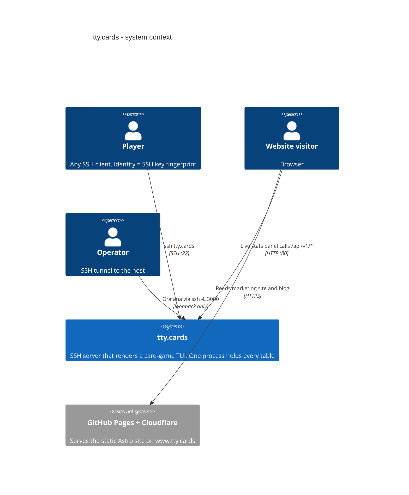

There is **no web game client**, no game HTTP API and no WebSocket. The only HTTP
surface is a read-only stats feed. See [`architecture.md` §1](architecture.md#1-what-this-is).

## 2. Containers (C4 level 2)

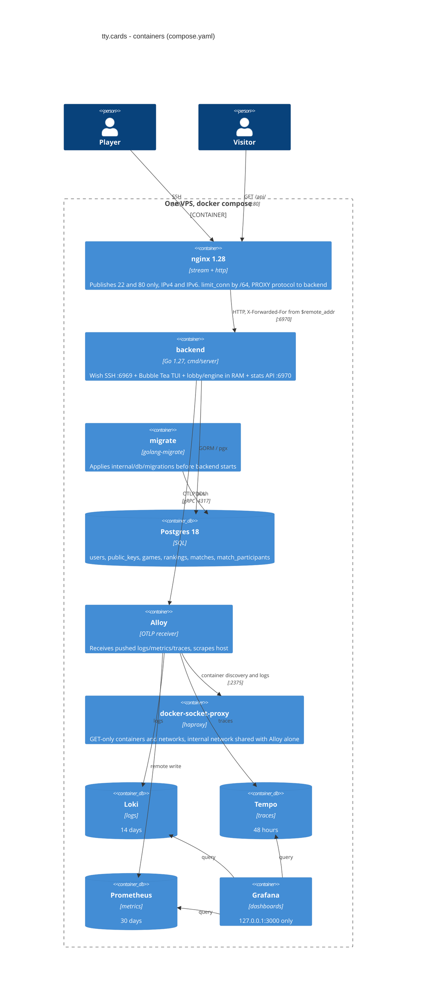

Why `:6969`/`:6970` are never published: [`decisions.md` #19](decisions.md#19-the-backend-speaks-proxy-protocol-and-6969-is-never-published).
nginx and the backend share the `edge` network (IPv6 on, fixed subnets), and the
backend believes a PROXY header or `X-Forwarded-For` only from it:
[#43](decisions.md#43-the-edge-network-runs-ipv6),
[#47](decisions.md#47-proxy-and-x-forwarded-for-are-believed-only-from-the-proxys-networks).
Limits at each layer: [`architecture.md` §2](architecture.md#2-topology).

## 3. Components inside the backend (C4 level 3)

Generated from `go list` imports (non-test), so it is what the compiler sees, not
what the docs hope. Game packages are grouped.

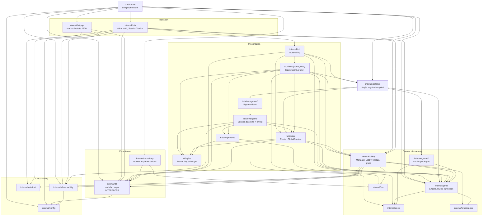

What the arrows prove:

- **`internal/game` depends only on `broadcaster` and `deck`.** No db, no tui, no
  lobby. That is lint-enforced (`depguard` rule `game-is-pure` in `.golangci.yml`).
- **Only `cmd/server` imports `internal/repository`.** Everything else sees the
  `db` interfaces (`depguard` rule `repository-only-from-root`).
- **`catalog` sits above both rules and views**, which is why `game` can never
  import it: it would be a cycle.
- **The TUI never reaches a `MatchRepository`.** Persistence after a game is the
  lobby's job. `router.GlobalContext` carries `*lobby.Manager` and a
  `UserRepository`, nothing else that writes.

Package responsibilities and the "must not" column: [`architecture.md` §8](architecture.md#8-package-responsibilities).

## 4. Key flows

### 4.1 A session, end to end

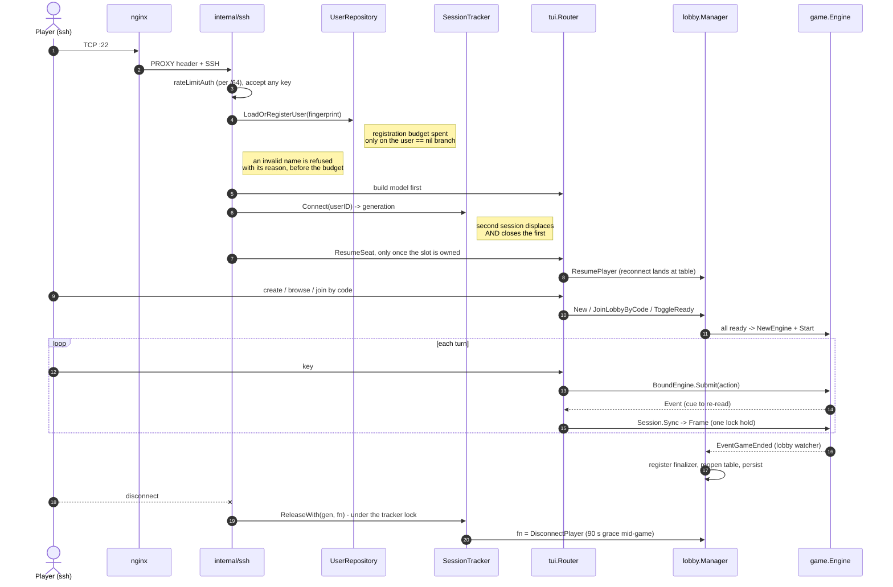

Owner: [`architecture.md` §3](architecture.md#3-the-spine-end-to-end).

### 4.2 One action inside the engine

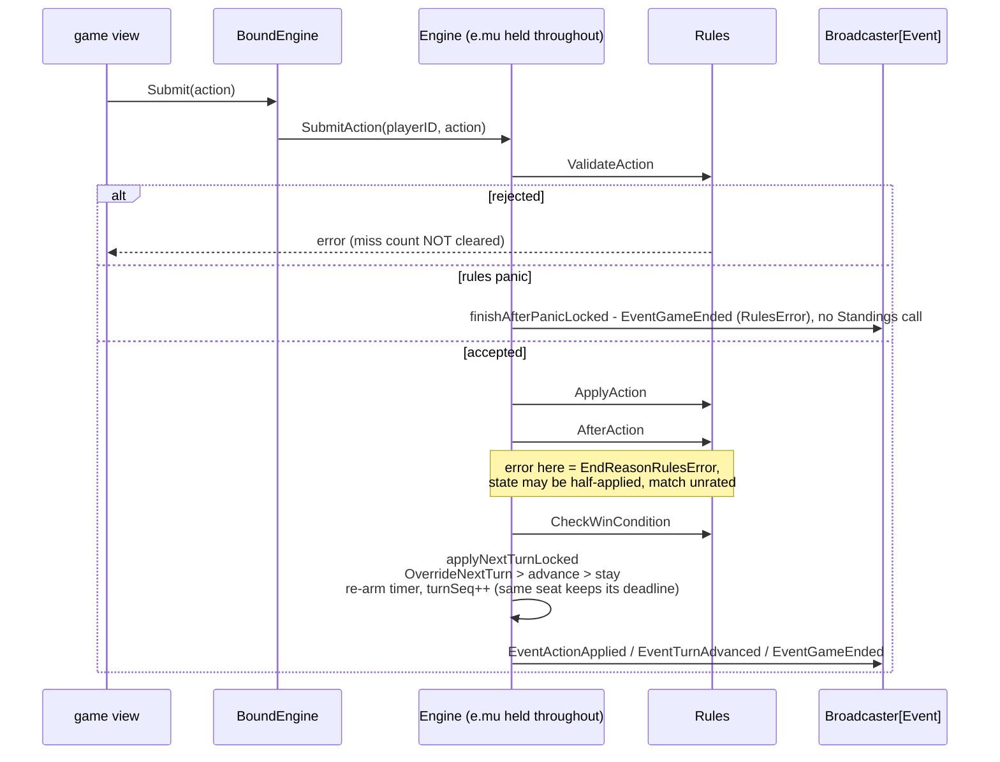

### 4.3 The turn clock

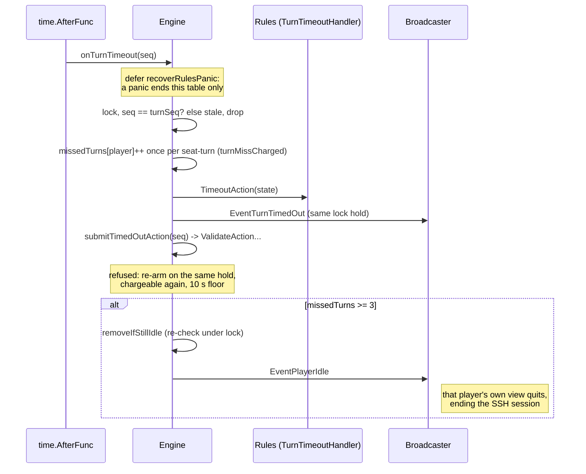

Owner: [`architecture.md` §4.2](architecture.md#42-turn-cursor-and-clock---applynextturnlocked),
[`decisions.md` #4](decisions.md#4-turnseq-a-generation-counter-fences-the-turn-clock).

### 4.4 Finishing a match

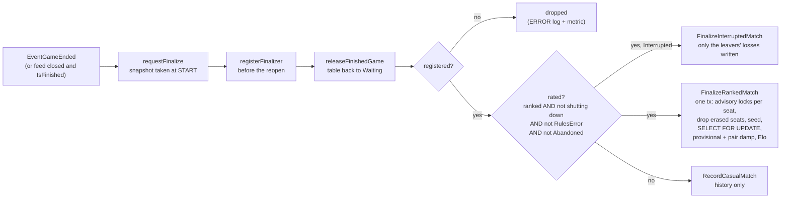

Owner: [`architecture.md` §3.6 and §6](architecture.md#36-finish---managerfinalizefinishedgame).

## 5. State machines

### 5.1 Lobby

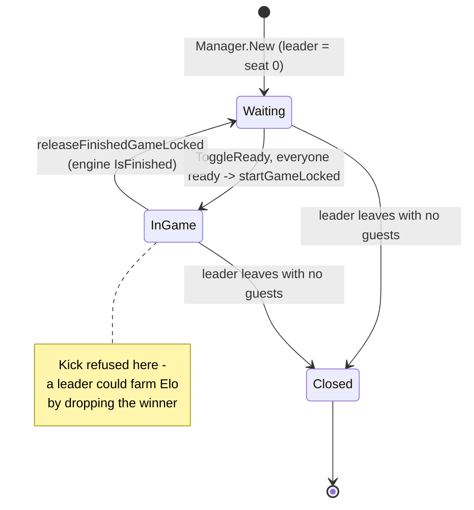

### 5.2 A mid-game disconnect

```mermaid
stateDiagram-v2
    Seated --> Pending: DisconnectPlayer (mid-game)
    Seated --> Left: DisconnectPlayer (waiting lobby or shutdown)
    Pending --> Seated: ResumePlayer inside 90 s
    Pending --> Expiring: timer fires, or hand ends (releaseHeldSeats), or BeginShutdown
    Expiring --> Left: LeaveLobby
    note right of Pending: engine auto-plays the seat;<br/>idle removal after 3 misses<br/>is the backstop
    note right of Expiring: claimed under m.mu so<br/>a racing resume is refused
```

Owner: [`architecture.md` §3.4](architecture.md#34-lobby---internallobby), [`decisions.md` #14](decisions.md#14-a-mid-game-seat-survives-90-seconds-with-the-engine-auto-playing).

## 6. Structure (UML)

### 6.1 The game contract

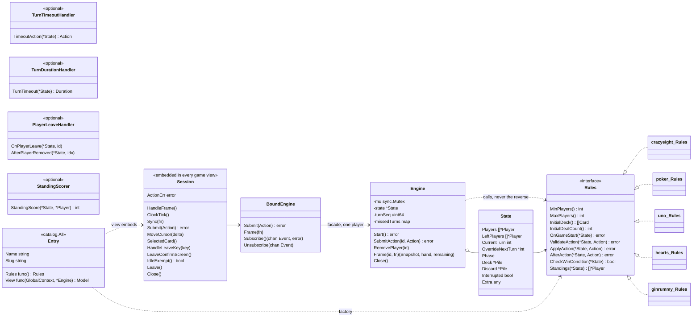

Which optional interfaces each game implements. Each is pinned by a
`var _ game.X = (*Rules)(nil)` line in its `rules.go`.

| Game | `TurnTimeoutHandler` | `TurnDurationHandler` | `PlayerLeaveHandler` | `StandingScorer` |
|---|:-:|:-:|:-:|:-:|
| Crazy Eights | yes | | yes | yes |
| Uno | yes | | yes | yes |
| Poker | yes | yes | yes | yes |
| Hearts | yes | yes | yes | yes |
| Gin Rummy | yes | yes | | yes |

Per-game state lives in `State.Extra`. Owner: [`architecture.md` §4](architecture.md#4-contracts-the-ones-that-bite).

### 6.2 Database (from the migrations)

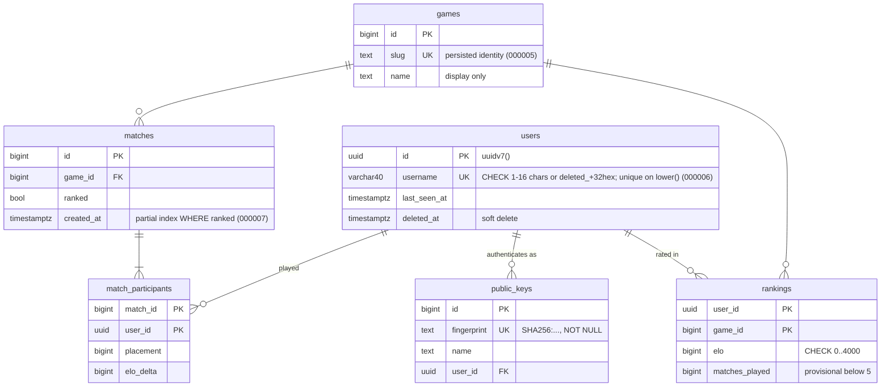

Owner: [`architecture.md` §6](architecture.md#6-persistence-elo-and-the-anti-farm-rules), [`data-inventory.md`](data-inventory.md).

## 7. Design patterns and decisions, at a glance

| Pattern | Where | Why it is here |
|---|---|---|
| Strategy | `game.Rules`, five implementations | a sixth game touches the engine in no way |
| Optional interface (capability probe) | `TurnTimeoutHandler`, `TurnDurationHandler`, `PlayerLeaveHandler`, `StandingScorer`, `router.Closer` | opt-in behaviour without a fat interface. No timeout handler means no clock |
| Single registration point | `catalog.All` | rules + view declared together. `catalog_test.go` catches missing fields and duplicate slugs |
| Facade | `game.BoundEngine` | the safe path is the default; `Frame`'s callback is the one way to whole-table state, and there is no `Engine()` escape hatch ([#5](decisions.md#5-boundengine-is-a-façade-not-a-capability)) |
| Embedded base type | `gameview.Session` | every view gets binding, update loop, clock tick, cursor, action error, forfeit prompt, idle exemption and `Close` for free |
| Observer, latest-wins | `broadcaster.Broadcaster[T]` | a slow SSH client can never stall the engine ([#3](decisions.md#3-latest-wins-broadcaster-and-subscribe-returns-an-error)) |
| Event as cue, not payload | `game.Event{Type, PlayerID, Reason}` | a dropped event costs nothing, the next `Frame` re-reads the truth |
| Snapshot / DTO | `StateSnapshot`, `BrowseEntry` | built under one lock, rendered lock-free. Hand sizes only |
| Fencing token | `Engine.turnSeq`, `SessionTracker` generations | stale timers and displaced sessions become no-ops |
| Repository, interface at the consumer | `internal/db` declares, `internal/repository` implements | swap point for Postgres; enforced by `depguard` |
| Functional options | `lobby.Option`, `game.EngineOption` | |
| Middleware chain | `wish.WithMiddleware` (runs last-first), `withCORS`/`withRateLimit` | |
| Elm architecture | every `tui/views/**` model | Bubble Tea |
| TTL cache + singleflight + generation | `repository.BestPlayers` (5 min; concurrent misses share one query; erasure bumps the generation) | a cold board is read by every lobby screen and the site at once, and an erased name must not be re-cached |
| TTL cache + dirty flag | public lobby list (2 s, atomic dirty flag, each entry re-checked on read) | the atomic flag exists to avoid inverting lock order |
| Single mutex per engine | `Engine.mu` | clock + state are always read together ([#1](decisions.md#1-one-mutex-per-engine)) |

Lock order, which every concurrency argument rests on: **tracker `t.mu` -> manager
`m.mu` -> lobby `l.mu` -> engine `e.mu`**. `State` has no lock. In Postgres, the
per-seat advisory lock comes before any row lock. See
[`architecture.md` §4.6](architecture.md#46-lock-order) and
[#45](decisions.md#45-the-session-tracker-lock-comes-before-the-managers).

The one decision most of the rest follows from: **one process holds the table.**
No Redis, no broker, no shared cache. Postgres keeps only what must outlive the
process.

## 8. What is there, what is not, what could be next

### 8.1 Deliberately absent (do not build without revisiting the decision)

| Absent | Reason | Record |
|---|---|---|
| Game loop / tick rate | the engine advances on an action or a timer only | [`onboarding.md` §5](onboarding.md#5-premises-that-do-not-hold) |
| Horizontal scaling, Redis, pub/sub | one process holds the table | [`architecture.md` §1](architecture.md#1-what-this-is) |
| Outbox table for match writes | two bounded drain windows instead; residual loss is stated and alertable | [#29](decisions.md#29-there-is-no-outbox-table-for-match-finalization) |
| Matchmaking queue | tables are browsed by Elo distance or joined by code | [`architecture.md` §3.4](architecture.md#34-lobby---internallobby) |
| Web or HTTP game client | the SSH terminal is the product | [`architecture.md` §1](architecture.md#1-what-this-is) |
| Passwords, email, account recovery | identity is a key fingerprint | [#16](decisions.md#16-identity-is-an-ssh-key-fingerprint) |
| Writes or auth on the stats API | narrowness is what makes it safe unauthenticated | [`architecture.md` §9](architecture.md#9-stats-api---internalhttpapi) |
| `/metrics`, pprof | the app pushes OTLP; nothing pulls it | [`architecture.md` §10](architecture.md#10-observability-and-retention) |

### 8.2 Known open items (not by design)

- **TLS on the apex is not configured.** The `:443` block in
  `internal/config/nginx.conf` is commented out. Until it lands, the `https` site's
  live-stats panel cannot call `http://tty.cards/api` and shows "server
  unreachable". Recorded as open in [#18](decisions.md#18-tls-is-not-terminated-here-yet-and-the-apex-cannot-sit-behind-cloudflare).
- **No tagged releases.** The changelog has only `[Unreleased]`, and there are no
  git tags.
- **Tracing stops at the session and the database.** `game`, `lobby` and `tui` are
  untraced, so a trace cannot show what happened between login and a match write.
- **No render-time metric.** Nothing times a `View()`; the benchmarks are the only
  signal.
- **No retention for inactive accounts.** Rows live until the player erases them
  ([`data-inventory.md` §1](data-inventory.md#1-stored-indefinitely---the-database)).
- **A new SSH key is a new account.** There is no way to attach a second key to an
  existing account, so changing laptops resets every rating.
- **`web/README.md` is the Astro starter template.** The real brief is `web/CLAUDE.md`.
- **The catalog lockstep hazard is accepted, not solved.** Copying an entry and
  changing only `Rules` compiles ([#6](decisions.md#6-catalogall-is-the-single-registration-point-and-the-lockstep-hazard-is-accepted)).

### 8.3 Not built, and no decision either way

No hit in non-test Go code for any of these: spectators, chat, bots, friends,
invites (beyond sharing a lobby code), tournaments, replays.

### 8.4 Candidate next steps

These are suggestions ranked by value over cost, not commitments. Each names the
seam that already exists for it.

1. **Terminate TLS on the apex** with certbot and uncomment the `:443` block. It
   unblocks the live-stats panel and needs no Go change.
2. **Link a second key to an account.** An authenticated session could add a
   `public_keys` row for a new fingerprint. The schema already allows many keys per
   user. Mind the anti-farm model: linking must not let one person merge alts.
3. **Tag a first release** and cut the changelog under it.
4. **Spectator seats.** The pieces exist. `StateSnapshot` is already the redaction
   boundary, and the broadcaster has `+8` subscriber headroom. What is missing is a
   read-only binding that never exposes a hand, plus a lobby route to reach it.
5. **Bots to fill a table.** Every game already ships a legal, safe move in
   `TimeoutAction`, which is soak-tested to pass `ValidateAction`. A bot seat could
   start by submitting exactly that. It must stay out of ranked play.
6. **Spans for lobby start and finalize.** Two spans would make a lost match
   visible in Tempo, not only as the `MatchFinalize(outcome="dropped")` metric.
7. **Retention for dormant accounts**, if the privacy policy needs one.
8. **Horizontal scale only when one VPS is not enough.** The seams are
   `broadcaster.Broadcaster[T]` and `Manager.lobbies`/`playerLobby`; the hard part is
   moving the lock-order guarantees across a network ([`onboarding.md` §5](onboarding.md#5-premises-that-do-not-hold)).

## 9. Keeping this current

Two code graphs index this repository. Both are local and gitignored.

| Tool | Refresh | Good for |
|---|---|---|
| GitNexus (`.gitnexus/`) | `node .gitnexus/run.cjs analyze --index-only` | `impact`, `context`, `query`, `detect-changes` - required by `CLAUDE.md` before edits |
| code-review-graph (`.code-review-graph/`) | `code-review-graph update` (full: `build`) | communities, flows, hub and bridge nodes, `architecture`, MCP tools via `.mcp.json` |

Regenerate the package diagram in §3 from the compiler:

```bash
go list -f '{{.ImportPath}}: {{join .Imports " "}}' ./cmd/... ./internal/... \
  | sed 's#github.com/Pieczasz/terminal-card/##g'
```

Caveats when reading graph output for Go:

- **`code-review-graph dead-code` over-reports.** It lists the optional-interface
  methods (`TimeoutAction`, `OnPlayerLeave`, `StandingScore`, …) as dead because
  they are reached through a type assertion. `make deadcode` is authoritative.
- **Same-named symbols merge.** Its top hub, `Equal`, is `Player.Equal` fused with
  testify's `assert.Equal`. The meaningful bridges it reports are
  `FinalizeRankedMatch`, `updateRankingsTx` and `Lobby.ToggleReady`.
- **GitNexus truncates flows.** Its analyze log says so. An absent flow is not
  an absent code path.
